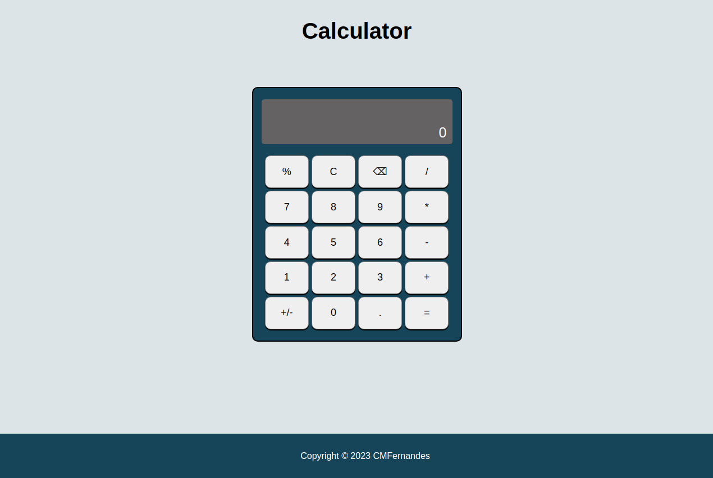

# calculator

:point_right: [live demo](https://cmfernandes.github.io/calculator/) 

---

## About

A Calculator built using  HTML5, CSS3 and JS ES6.

Assigment from [The Odin Project](https://www.theodinproject.com/lessons/foundations-calculator) Foundations course.